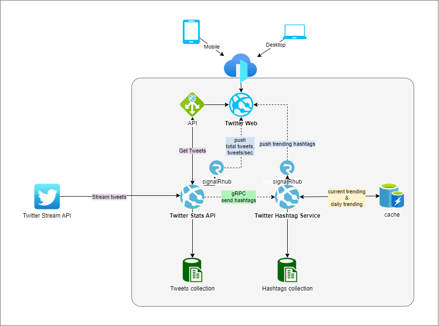

# Twitter Stream Code Challenge!

Utilize Twitter stream endpoint and processes tweets in real time. 
The app should keep track of the # number of tweets received and top 10 hashtags

# Tech stack

 - NET 7.0
 - Angular 14.1.3
 - ASP.NET Core API
 - SignalR
 - gRPC

## App Components

 - **Twitter.Web** - Web application that displays the following:
	 - Recent Twitter Feed
	 - Total Tweets received
	 - Processed Tweets per second
	 - Trending Hashtags
 - **Twitter.Stats.API** - Responsible for streaming Twitter's Stream API and processing all tweets related data
	 - Saving tweets to mongoDB
	 - Extracting hashtags and sending it to Twitter.Hashtag.Service
	 - Pushing   Total Tweets received and Processed Tweets per second to Twitter.Web(UI)
	 - Exposes API for GetRecentTweets and GetPaginatedTweets
 - **Twitter.Hashtag.Service** - Responsible for processing all hashtags related data
	 - Saving hashtags to mongoDB
	 - Saving trending hashtags to Cache
	 - Has a Cron Job for creating the daily trending hashtags to Cache
	 - Pushing trending hashtags  to Twitter.Web(UI)
	 -  Exposes API for GetDayTrending and GetTrending hashtags

## Architecture Diagram

## Project Repo

Github link: https://github.com/tikiyu/twttrstrm